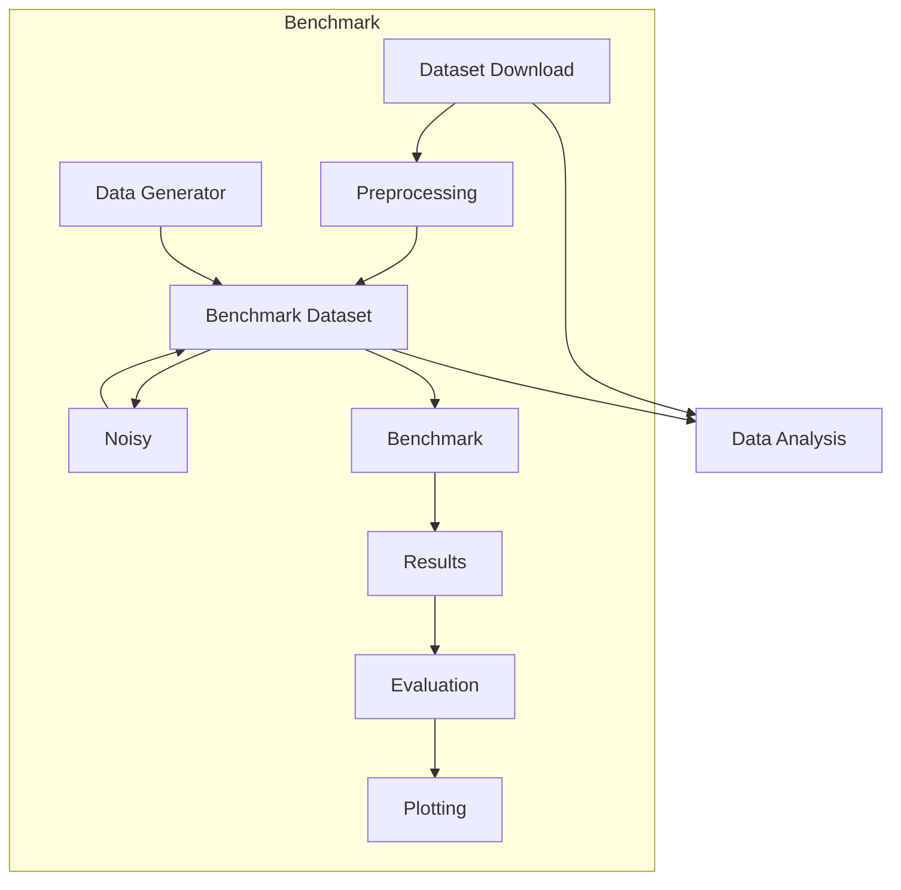

Split into steps:

- Data Download
- Data Preprocessing / Data Generator
- (Data Analysis)
- Optional Noise Generation on Data
- Benchmark -> Results
  - Make Benchmark Implementation language agnostic (see https://github.com/HPI-Information-Systems/TimeEval)
- Results Plotting

Publish as Python Package: LDIMBench - Leakage Detection and Isolation Method Benchmark

https://pypi.org/project/poetry-multiproject-plugin/

Try it out with single algorithm, then shape the API after it

- incorporate a single debug run
- multiple runs (which might be aborted)
- analysis to compare the different runs
- use of hyperparameters per dataset (and defined by the algorithm)
- results from a single run can be incorporated into the overall results for comparison between algorithms

- remove leaks.csv for benchmark run (in order to prevent methods taking advantage of it)

- automatic benchmarks: https://tomasvotruba.com/blog/2020/11/16/how-to-make-dynamic-matrix-in-github-actions/

TODOS:

- https://squidfunk.github.io/mkdocs-material/reference/tooltips/#adding-abbreviations
