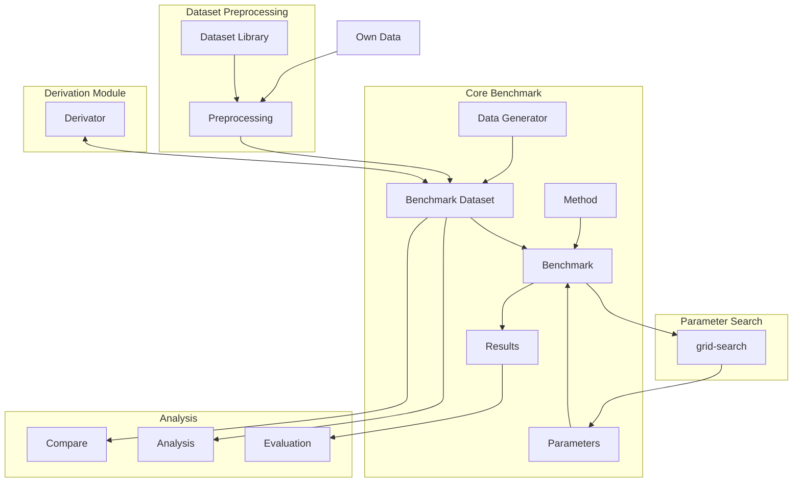

```mermaid
graph TD;
  own_dataset[Own Data]-->preprocessing[Preprocessing];

  subgraph Core Benchmark
    generator[Data Generator]-->dataset;

    method[Method] --> benchmark
    parameters[Parameters] --> benchmark
    dataset-->benchmark[Benchmark];

    benchmark-->results[Results];
  end

  subgraph Dataset Preprocessing
    download[Dataset Library]-->preprocessing[Preprocessing];
    preprocessing-->dataset[Benchmark Dataset];
  end

  subgraph Parameter Search
    benchmark --> grid-search
    grid-search --> parameters
  end

  subgraph Derivation Module
     derivator[Derivator] <--> dataset

  end

  subgraph Analysis
    dataset --> compare[Compare]
    dataset --> analysis[Analysis]
    results-->evaluation[Evaluation];
  end
```
